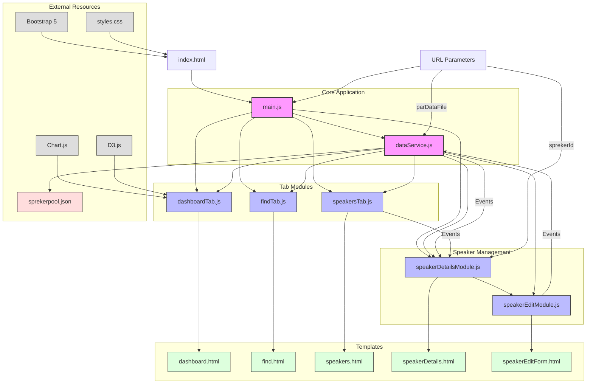

# Sprekerpool Application Architecture

This document provides a detailed overview of the technical architecture and implementation of the Sprekerpool Speaker Management Application.

## Architecture Overview

The Sprekerpool application is built as a client-side Single Page Application (SPA) using modern JavaScript (ES6+) with a modular architecture. The application follows these key architectural principles:

1. **Modular Design**: Functionality is separated into distinct modules with clear responsibilities
2. **Data Centralization**: A central data service manages all data access and manipulation
3. **Event-Driven Communication**: Components communicate via custom events
4. **Dynamic Content Loading**: HTML templates are loaded dynamically as needed
5. **Responsive UI**: Bootstrap 5 provides responsive design capabilities

## Application Architecture Diagram

The following diagram illustrates the structure and component relationships of the Sprekerpool application:



This diagram shows:
- The core application components (main.js and dataService.js)
- The tab modules and their HTML templates
- The speaker management modules
- Data flow between components
- Event communication
- URL parameter handling
- External resources and libraries


## Application Structure

```
sprekerpool-webapp/
├── css/
│   └── styles.css               # Custom styles
├── data/
│   └── sprekerpool.json         # Speaker data source
├── js/
│   ├── dataService.js           # Centralized data management
│   ├── main.js                  # Application initialization
│   ├── modules/
│   │   ├── speakerDetailsModule.js  # Speaker details functionality
│   │   ├── speakerEditModule.js     # Speaker editing functionality
│   │   └── tabs/
│   │       ├── dashboard.html       # Dashboard tab template
│   │       ├── dashboardTab.js      # Dashboard tab logic
│   │       ├── find.html            # Find tab template
│   │       ├── findTab.js           # Find tab logic
│   │       ├── speakers.html        # Speakers tab template
│   │       ├── speakersTab.js       # Speakers tab logic
│   │       ├── speakerDetails.html  # Speaker details modal
│   │       └── speakerEditForm.html # Speaker edit form
├── index.html                   # Main application entry point
└── README.md                    # Project documentation
```

## Core Components

### 1. Main Application (main.js)

The entry point of the application that handles:
- Application initialization
- DOM content loading
- Tab navigation and event listeners
- URL parameter processing

```javascript
// Initialization flow
document.addEventListener('DOMContentLoaded', initializeApp);

async function initializeApp() {
    // Load speaker data first
    await loadSpeakerData();
    
    // Load initial tab content (dashboard is active by default)
    await loadDashboardContent();
    
    // Set up tab event listeners
    initializeTabEventListeners();
    
    // Initialize speaker details module
    await initializeSpeakerDetails();
    
    // Check if sprekerId query parameter exists
    checkForSpeakerIdParameter();
}
```

### 2. Data Service (dataService.js)

A centralized service that manages all data operations:
- Loading speaker data from JSON file
- Providing methods to access and filter speaker data
- Updating speaker information
- Dispatching events when data changes

```javascript
// Data is stored in memory
let speakerData = [];

// Data loading with URL parameter support
export async function loadSpeakerData() {
    try {
        const response = await fetch(getDataUrl());
        const data = await response.json();
        speakerData = data;
        return data;
    } catch (error) {
        console.error('Error loading speaker data:', error);
        return [];
    }
}

// Example of data access method
export function getSpeakerById(id) {
    return speakerData.find(speaker => speaker.id === id);
}

// Example of data update with event dispatch
export function updateSpeaker(updatedSpeaker) {
    // Update data
    speakerData[index] = updatedSpeaker;
    
    // Notify components via custom event
    const event = new CustomEvent('speakerDataUpdated', { 
        detail: { speakerId: updatedSpeaker.id } 
    });
    document.dispatchEvent(event);
}
```

### 3. Tab Modules

Each tab is implemented as a separate module with its own HTML template and JavaScript logic:

#### Dashboard Tab (dashboardTab.js)
- Displays statistics and visualizations
- Creates charts using Chart.js
- Implements interactive data visualizations

```javascript
async function loadDashboardContent() {
    // Load HTML template
    const response = await fetch('js/modules/tabs/dashboard.html');
    const html = await response.text();
    document.getElementById('dashboard-content').innerHTML = html;
    
    // Initialize components
    displaySpeakerStatistics(speakers);
    createCompanyChart(speakers);
    createLanguagesChart(speakers);
    createTopicsCloud(speakers);
}
```

#### Find Tab (findTab.js)
- Implements search functionality
- Filters speakers based on criteria
- Displays search results

#### Speakers Tab (speakersTab.js)
- Displays all speakers in a table format
- Implements sorting functionality
- Provides access to speaker details

### 4. Speaker Details Module (speakerDetailsModule.js)

Handles displaying detailed information about a speaker:
- Loads modal HTML template
- Populates speaker information
- Manages modal display
- Handles navigation to edit mode

```javascript
// Function to show speaker details
function showSpeakerDetails(speakerId) {
    // Store the current speaker ID
    currentSpeakerId = speakerId;
    
    // Get the speaker data
    const speaker = getSpeakerById(speakerId);
    
    // Populate the modal with speaker details
    populateSpeakerDetails(speaker);
    
    // Show the modal
    speakerDetailsModal.show();
}
```

### 5. Speaker Edit Module (speakerEditModule.js)

Manages editing speaker information:
- Loads edit form template
- Populates form with current speaker data
- Validates input
- Saves changes via the data service

## Key Technical Implementations

### Dynamic Content Loading

The application loads HTML templates dynamically using the Fetch API:

```javascript
async function loadTemplate(containerId, templatePath) {
    try {
        const response = await fetch(templatePath);
        const html = await response.text();
        document.getElementById(containerId).innerHTML = html;
    } catch (error) {
        console.error(`Error loading template ${templatePath}:`, error);
    }
}
```

### Event-Driven Communication

Components communicate through custom events:

```javascript
// Dispatching an event
const event = new CustomEvent('speakerDataUpdated', { 
    detail: { speakerId: updatedSpeaker.id } 
});
document.dispatchEvent(event);

// Listening for an event
document.addEventListener('speakerDataUpdated', (event) => {
    // Handle the event
    if (event.detail.speakerId === currentSpeakerId) {
        showSpeakerDetails(currentSpeakerId);
    }
});
```

### URL Parameter Handling

The application supports URL parameters for direct access to specific content:

```javascript
// Check for sprekerId parameter
function checkForSpeakerIdParameter() {
    const urlParams = new URLSearchParams(window.location.search);
    const sprekerId = urlParams.get('sprekerId');
    
    if (sprekerId) {
        // Navigate to speakers tab and show details
        loadSpeakersContent().then(() => {
            const speakersTab = new bootstrap.Tab(document.getElementById('speakers-tab'));
            speakersTab.show();
            
            setTimeout(() => {
                showSpeakerDetails(sprekerId);
            }, 500);
        });
    }
}

// Get data URL based on parameters
const getDataUrl = () => {
    const urlParams = new URLSearchParams(window.location.search);
    const dataFileParam = urlParams.get('parDataFile');
    
    if (dataFileParam) {
        return dataFileParam;
    }
    return localDataURL;
}
```

### Data Visualization

The application uses Chart.js for interactive data visualizations:

```javascript
function createCompanyChart(speakers) {
    // Process data
    const companyData = processCompanyData(speakers);
    
    // Create chart
    const ctx = document.getElementById('company-chart').getContext('2d');
    companyChart = new Chart(ctx, {
        type: 'pie',
        data: {
            labels: companyData.labels,
            datasets: [{
                data: companyData.values,
                backgroundColor: generateColors(companyData.labels.length)
            }]
        },
        options: {
            // Chart configuration
            onClick: (event, elements) => {
                // Handle click events for interactivity
            }
        }
    });
}
```

## Design Patterns

### Module Pattern

The application uses ES6 modules to encapsulate functionality:

```javascript
// Export specific functions
export { loadDashboardContent };

// Import from other modules
import { getAllSpeakers } from '../../dataService.js';
```

### Observer Pattern

The application implements the Observer pattern through custom events:

1. Components subscribe to events they're interested in
2. The data service publishes events when data changes
3. Subscribed components react to these changes

### Factory Pattern

Some components use factory-like functions to create UI elements:

```javascript
function createSpeakerCard(speaker) {
    const card = document.createElement('div');
    card.className = 'card speaker-card';
    
    // Build card content
    
    return card;
}
```

## Performance Considerations

### Lazy Loading

Templates and content are loaded only when needed:

```javascript
// Content is loaded only when the tab is activated
tab.addEventListener('shown.bs.tab', function (event) {
    const targetTabId = event.target.getAttribute('id');
    
    switch (targetTabId) {
        case 'dashboard-tab':
            loadDashboardContent();
            break;
        // Other tabs...
    }
});
```

### Memory Management

The application manages memory by:
- Storing references to charts to prevent memory leaks
- Cleaning up event listeners when components are destroyed
- Reusing existing DOM elements when possible

## Security Considerations

### Data Validation

The application performs basic validation on user inputs:
- Checking for required fields
- Validating email formats
- Sanitizing inputs to prevent XSS attacks

### URL Parameter Validation

Parameters from URLs are validated before use:
- Checking if IDs exist in the data
- Handling invalid parameters gracefully

## Limitations and Future Improvements

### Current Limitations

1. **Client-Side Only**: All data is stored in memory and lost on page refresh
2. **Limited Validation**: Basic validation without comprehensive error handling
3. **No Authentication**: No user authentication or authorization
4. **Limited Data Persistence**: Changes are not saved to a server

### Future Architectural Improvements

1. **Backend Integration**:
   - Add a RESTful API for data persistence
   - Implement proper error handling and validation

2. **State Management**:
   - Introduce a more robust state management solution
   - Consider using a library like Redux for complex state

3. **Build Process**:
   - Add a build process with Webpack or Rollup
   - Implement code splitting for better performance

4. **Testing**:
   - Add unit tests for core functionality
   - Implement end-to-end testing

5. **Enhanced URL Parameter Support**:
   - Support for more complex URL parameters
   - Deep linking to specific views and filters


## Conclusion

The Sprekerpool application demonstrates a well-structured, modular architecture using modern JavaScript practices. Its event-driven approach and separation of concerns make it maintainable and extensible. While it has some limitations as a client-side only application, the architecture provides a solid foundation for future enhancements.
