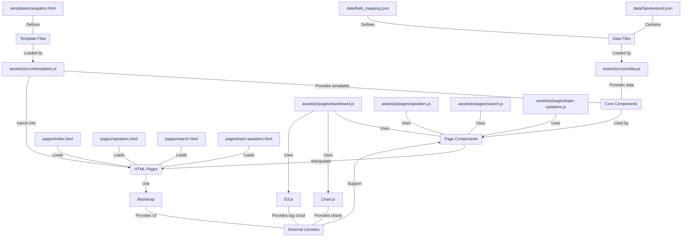

# Speakerpool Web Application Architecture

This document provides a detailed overview of the Speakerpool web application architecture, including component structure, data flow, and design patterns.

## Architecture Overview

The Speakerpool application follows a modular, component-based architecture using vanilla JavaScript with ES modules. It's designed as a client-side single-page application (SPA) with multiple views that share a common data layer.

## Architecture Diagram



This diagram shows the main components of the application and how they interact with each other. The core components provide data and template functionality to the page components, which manipulate the HTML pages. External libraries support the page components, and data files are loaded by the data module.

## Directory Structure

The application follows a well-organized directory structure that separates concerns and groups related files together:

```
speakerpool-webapp/
├── assets/                    # Static assets
│   ├── css/                   # CSS files
│   │   └── styles.css         # Main stylesheet
│   ├── js/                    # JavaScript files
│   │   ├── components/        # UI components
│   │   ├── core/              # Core functionality
│   │   │   ├── data.js        # Data management
│   │   │   └── templates.js   # Template system
│   │   ├── pages/             # Page-specific scripts
│   │   │   ├── dashboard.js   # Dashboard page
│   │   │   ├── speakers.js    # Speaker details page
│   │   │   ├── search.js      # Search page
│   │   │   └── topic-speakers.js # Topic speakers page
│   │   └── utils/             # Utility functions
│   └── images/                # Image assets
├── data/                      # Data files
│   ├── Sprekerpool.json       # Speaker data
│   └── field_mapping.json     # Field mapping configuration
├── docs/                      # Documentation
│   ├── ARCHITECTURE.md        # Architecture documentation
│   └── DIRECTORY_STRUCTURE.md # Directory structure documentation
├── pages/                     # HTML pages
│   ├── index.html             # Dashboard/overview page
│   ├── speakers.html          # Speaker details page
│   ├── search.html            # Search page
│   └── topic-speakers.html    # Topic speakers page
├── templates/                 # HTML templates
│   └── navigation.html        # Navigation template
└── scripts/                   # Utility scripts
    └── convert_csv_to_json.py # Data conversion script
```

## Core Components

### 1. Data Layer

The data layer is responsible for loading, processing, and providing access to speaker data throughout the application.

**Key Files:**
- `assets/js/core/data.js` - Central data module that handles data loading and processing

**Responsibilities:**
- Loading speaker data from JSON
- Providing methods to access and filter data
- Processing data for visualization and display
- Caching data to minimize repeated fetching

**Design Pattern:** Singleton module with public API

**Code Example:**
```javascript
// assets/js/core/data.js
const SpeakerData = {
    speakers: [],
    
    async loadSpeakers() {
        // Load data from JSON file
    },
    
    getAllSpeakers() {
        return this.speakers;
    },
    
    getSpeakerById(id) {
        // Return specific speaker
    }
};

export default SpeakerData;
```

### 2. View Components

Each page in the application is represented by a dedicated view component that handles the UI logic for that specific view.

**Key Files:**
- `assets/js/pages/dashboard.js` - Dashboard/overview page
- `assets/js/pages/speakers.js` - Speaker details page
- `assets/js/pages/search.js` - Search functionality
- `assets/js/pages/topic-speakers.js` - Topic-specific speaker listing

**Responsibilities:**
- Rendering UI elements
- Handling user interactions
- Updating the view based on data changes
- Managing page-specific state

**Design Pattern:** Module pattern with initialization function

**Code Example:**
```javascript
// assets/js/pages/dashboard.js (Dashboard component)
const Dashboard = {
    charts: { /* ... */ },
    
    async init() {
        // Initialize the dashboard
        await SpeakerData.loadSpeakers();
        this.updateDashboard();
    },
    
    updateDashboard() {
        // Update UI elements
    }
};
```

### 3. Template System

The template system provides a way to share common UI components across multiple pages.

**Key Files:**
- `assets/js/core/templates.js` - Template loading and management
- `templates/navigation.html` - Shared navigation template

**Responsibilities:**
- Loading HTML templates
- Inserting templates into the DOM
- Setting active states based on current page

**Design Pattern:** Async template loader with caching

**Code Example:**
```javascript
// templates.js
const Templates = {
    cache: {},
    
    async init() {
        await this.loadNavigation();
        this.setActiveNavItem();
    },
    
    async loadNavigation() {
        // Load and insert navigation template
    }
};
```

### 4. Visualization Components

Specialized components for data visualization using third-party libraries.

**Implementations:**
- Company distribution (pie chart using Chart.js)
- Language distribution (pie chart using Chart.js)
- Topics tag cloud (interactive visualization using D3.js)

**Responsibilities:**
- Creating and updating visualizations
- Handling visualization-specific interactions
- Responding to data changes

## Data Flow

1. **Initial Load:**
   - User accesses a page
   - Template system loads shared components
   - Data module fetches speaker data
   - View component initializes and renders the UI

2. **User Interactions:**
   - User interacts with the UI (e.g., searches, filters, selects)
   - View component handles the interaction
   - Data is filtered or processed as needed
   - UI is updated to reflect changes

3. **Navigation:**
   - User navigates to a different page
   - Browser loads the new HTML page
   - Process repeats with the new view component

## Module Dependencies

```
┌───────────────────┐     ┌────────────────────┐     ┌────────────────────┐
│assets/js/core/    │◄────│assets/js/pages/    │     │assets/js/core/     │
│data.js           │     │dashboard.js        │     │templates.js        │
└───────────────────┘     └──────┬─────────────┘     └──────┬─────────────┘
       ▲                         │                          │
       │                   ┌─────┴─────┐              ┌─────┴─────┐
       │                   │ Chart.js  │              │ templates/ │
       │                   │   D3.js   │              │ navigation │
       │                   └───────────┘              └───────────┘
       │
┌──────┴──────────────┐     ┌────────────────────┐
│assets/js/pages/     │     │assets/js/pages/    │
│speakers.js         │     │search.js           │
└─────────────────────┘     └────────────────────┘
       ▲                          ▲
       │                          │
       └──────────┬───────────────┘
                  │
        ┌─────────┴────────────┐
        │assets/js/pages/      │
        │topic-speakers.js     │
        └──────────────────────┘
```

## Design Patterns

1. **Module Pattern**
   - Each component is implemented as a self-contained module
   - Private state and public API
   - Initialization function for setup

2. **Singleton Pattern**
   - Data module is a singleton with a shared state
   - Ensures consistent data across components

3. **Observer Pattern (Implicit)**
   - UI components observe data changes
   - Update visualizations and displays accordingly

4. **Template Method Pattern**
   - Common UI structures defined in templates
   - Specialized by different view components

## Performance Considerations

1. **Data Loading**
   - Data is loaded once and cached
   - Shared across all components

2. **Lazy Loading**
   - Templates are loaded on demand
   - Cached for future use

3. **DOM Manipulation**
   - Batch DOM updates where possible
   - Use document fragments for multiple insertions

4. **Visualization Optimization**
   - Charts are destroyed and recreated to prevent memory leaks
   - Canvas elements are properly managed

## Security Considerations

1. **Data Sanitization**
   - All user-generated content is sanitized before display
   - HTML content is properly escaped

2. **Input Validation**
   - Search inputs are validated and sanitized
   - URL parameters are checked for validity

3. **No Server-Side Processing**
   - As a static application, there are no server-side vulnerabilities
   - All processing happens client-side

## Extensibility

The architecture is designed to be easily extensible:

1. **Adding New Views**
   - Create a new HTML file
   - Create a corresponding JS module
   - Add to navigation template

2. **Adding New Features**
   - Extend existing modules or create new ones
   - Use the shared data layer

3. **Adding New Visualizations**
   - Implement in the appropriate view component
   - Use the same pattern as existing visualizations

## Future Architecture Considerations

1. **State Management**
   - Consider adding a more robust state management solution for complex state

2. **Build Process**
   - Add a build step for minification and bundling
   - Implement CSS preprocessing

3. **Testing**
   - Add unit tests for core functionality
   - Implement end-to-end testing

4. **Backend Integration**
   - Design API interfaces for future backend integration
   - Implement authentication and authorization
